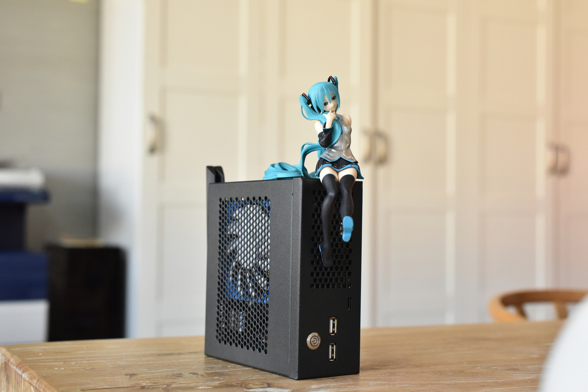
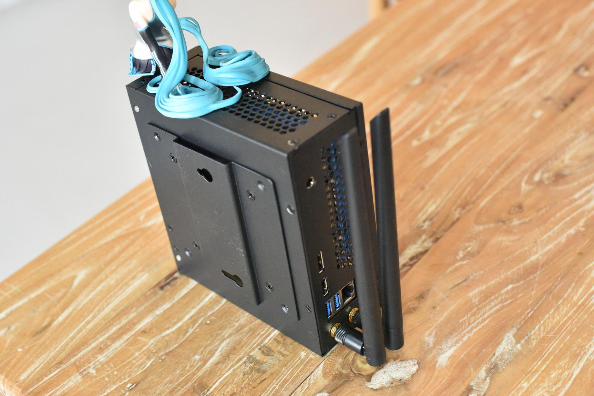
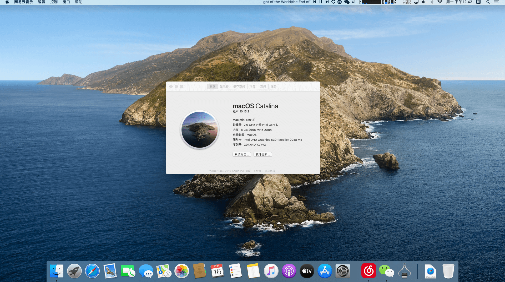
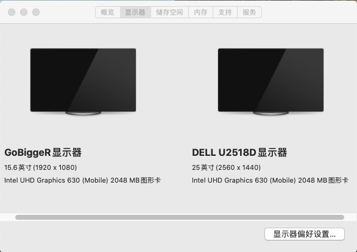
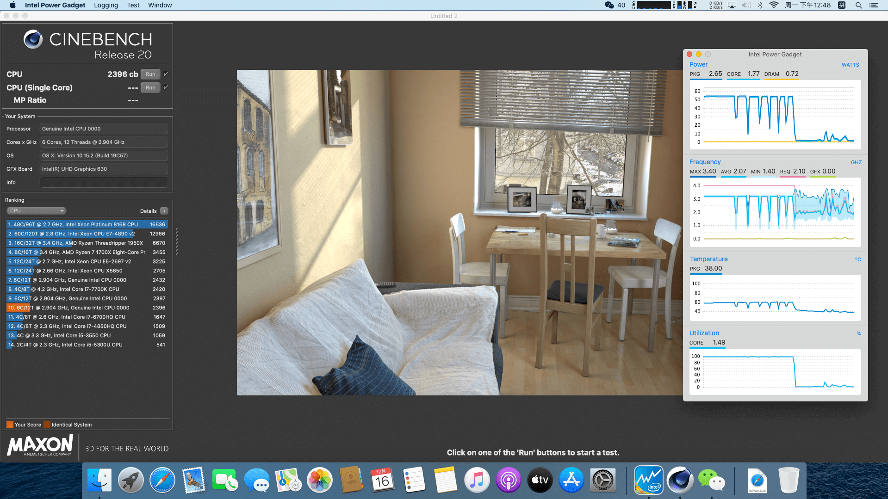
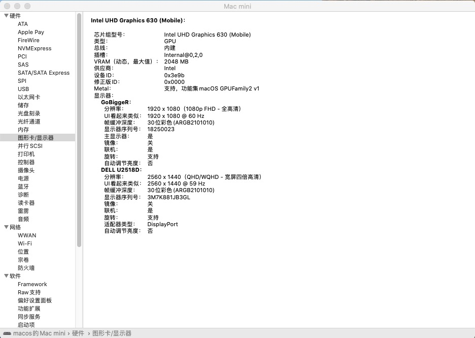
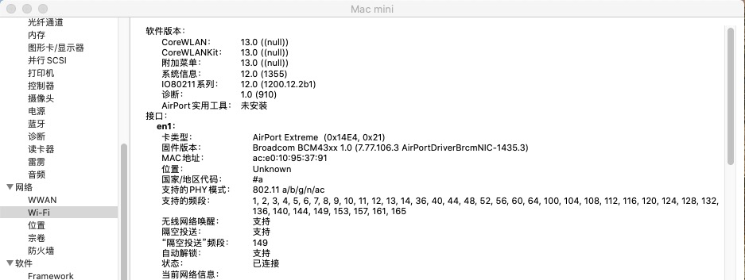
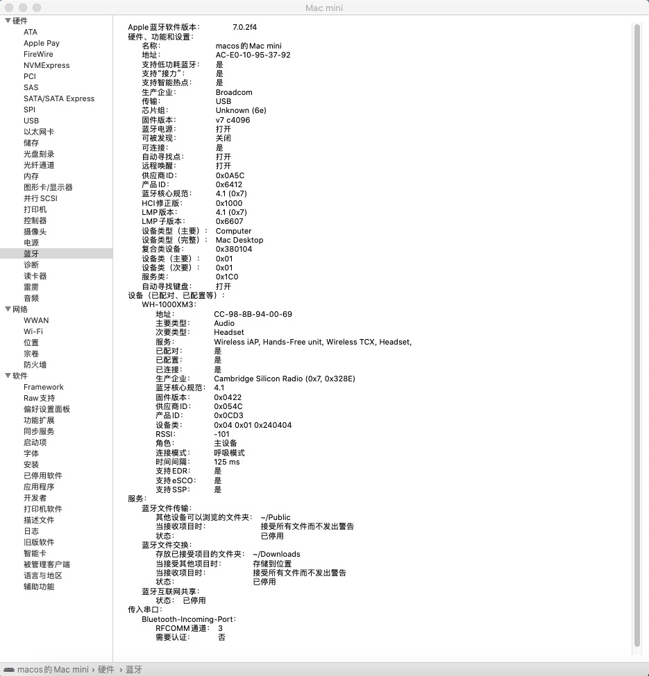
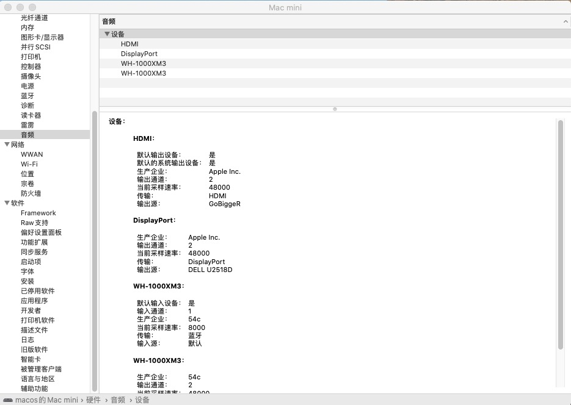
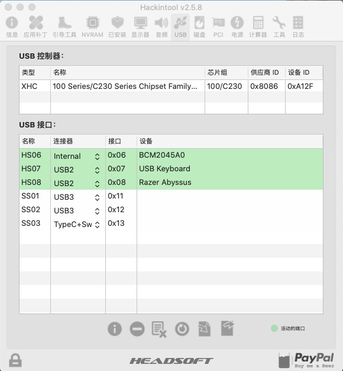

# cloud-hin-h170-stx-hackintosh

云轩H170迷你主机黑苹果EFI文件

## 1.0

迫于吃灰，我把手上的机器卖掉了。这个repo八成也不会再更新。有问题的话可以去交流 QQ 群：775913192。京东店主也在群里，买机器有优惠。

## 1.1. 说明 

使用前务必阅读参考资料中前两篇文章。DW1820a有很多子型号，需要改EFI文件。预算充足建议上免驱卡（比如BCM943602CS）

缓慢施工中，周末有空再补文档

## 1.2. 截图

## 1.3. 硬件配置

|硬件|型号|
|---|---|
| 准系统 | 云轩H170迷你主机 |
| CPU | i7 8700 es |
| 蓝牙wifi | DW1830 |
| 内存 | 协德 DDR4 2666 8G |
| SSD | 镁光 m1100 256G |

## 1.4. 工作情况

- [x] CPU变频
- [x] 核显
- [x] 睡眠
- [x] 网卡
- [x] WIFI
- [x] 蓝牙
- [x] USB

## 1.5. 未解决问题

蓝牙信号有点弱。不过我所在的环境白苹果黑苹果蓝牙都有点卡卡的，不知道

## 1.6. BIOS设置

全默认就行。也不需要关 VT-d

## 1.7. 更新日志

[查看更志 里面什么都没有](CHANGELOG.md)

## 1.8 参考资料

[EFI文件参考：可能是最便宜的STX黑苹果主机？](https://post.smzdm.com/p/a83928mn/?send_by=8753099381)

[DW1820A驱动：DW1820A/BCM94350ZAE插入的正确姿势 | 黑果小兵的部落阁](https://blog.daliansky.net/DW1820A_BCM94350ZAE-driver-inserts-the-correct-posture.html)

[USB定制端口：Hackintool(原Intel FB-Patcher)使用教程及插入姿势](https://blog.daliansky.net/Intel-FB-Patcher-tutorial-and-insertion-pose.html)

